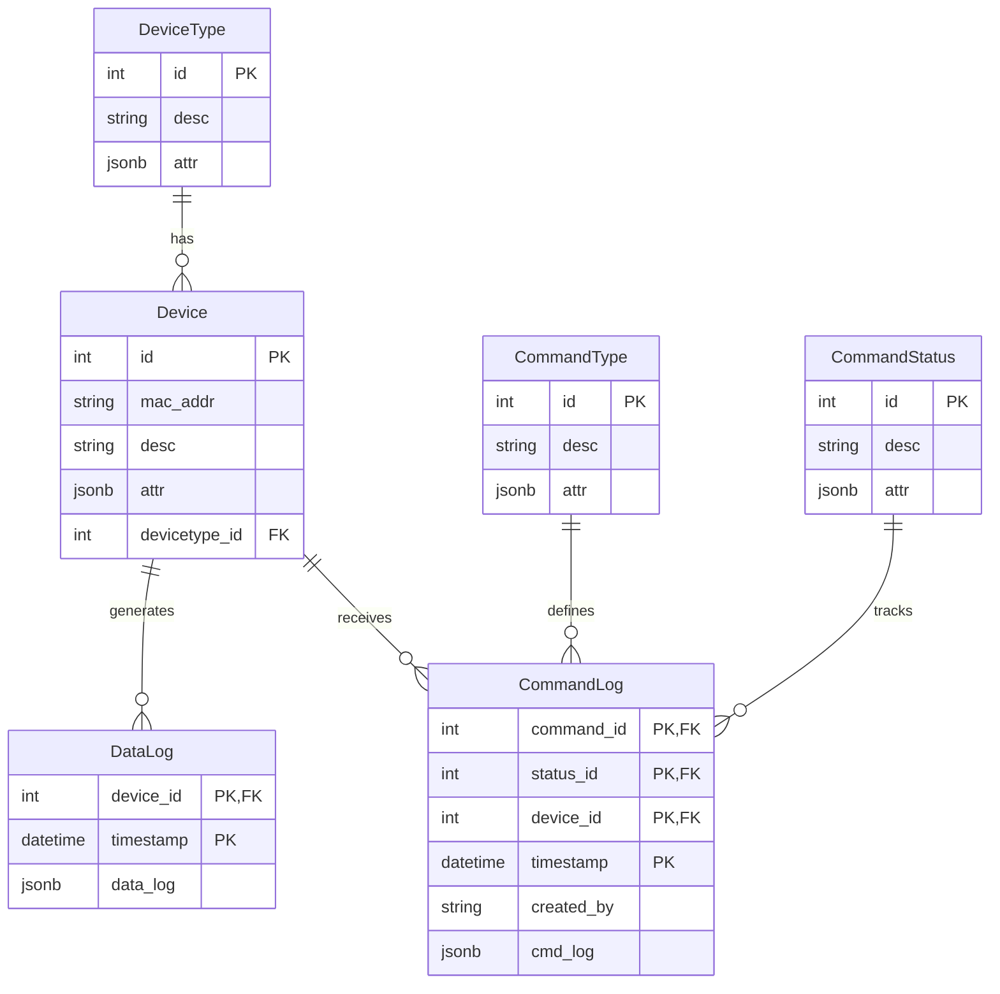
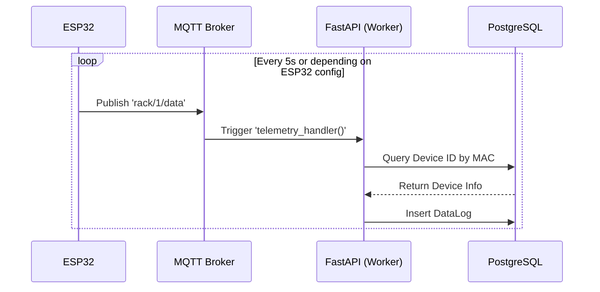
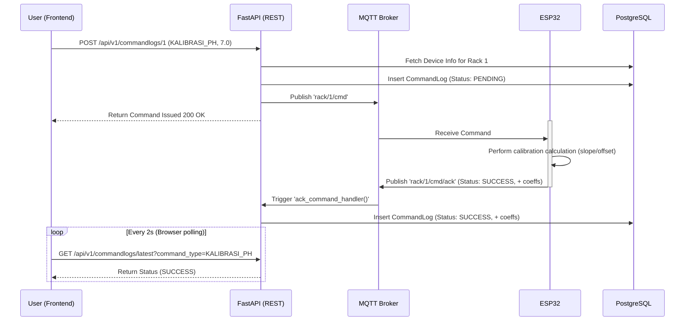

# Smart Farming Lab - Technical Documentation

## 1. Introduction
The **Smart Farming Lab** is an end-to-end IoT platform designed to monitor and control hydroponic racks. The platform captures real-time telemetry (pH, EC, water temperature, water levels, water flow, and light intensity) from ESP32 controllers, stores the data for analytics, and provides a modern web interface for users to oversee the farm's status and perform sensor calibrations.

### Tech Stack
*   **IoT:** ESP32 Microcontrollers, various environmental/water sensors.
*   **Message Broker:** Eclipse Mosquitto (MQTT).
*   **Backend:** Python 3.14, FastAPI, SQLModel (SQLAlchemy 2.0), asyncpg, Paho-MQTT.
*   **Database:** PostgreSQL 18.
*   **Frontend:** React 19, Next.js 16 (App Router), Tailwind CSS v4, Recharts, Shadcn/UI.
*   **Deployment:** Docker & Docker Compose.

---

## 2. System Architecture

The system follows a three-layer architecture: Device/Edge Layer, Data & Logic Layer, and Presentation Layer.


1.  **Edge Layer:** Collects sensor data periodically. It is also responsible for executing commands (e.g., turning on pumps, executing calibrations based on slopes).
2.  **Data & Logic Layer:** 
    *   **Mosquitto:** Acts as the central nervous system connecting devices and backend.
    *   **FastAPI:** runs a background MQTT worker thread to ingest data into the database and handles REST API requests to query that data.
3.  **Presentation Layer:** 
    *   Next.js API layer acts as a proxy to the backend to prevent CORS issues. It also maintains a short-term in-memory state of the latest 25 readings specifically for quick chart rendering on the frontend.
    *   React Client renders dashboards based heavily on local state processing and Recharts.

---

## 3. Database Schema

The database uses a relational schema defined via SQLModel. It uses strongly typed relationships mapping telemetry data and commands.



*Note: `device_id` represents the software ID within the DB, whereas `rack_id` (the physical rack number 1-5) is stored under the `attr` JSONB column in the `Device` table.*

---

## 4. Communication Protocols

### 4.1 MQTT Topics

| Topic | Direction | Publisher | Subscriber | Purpose |
| :--- | :---: | :--- | :--- | :--- |
| `device/+/register` | Upbound | ESP32 | Backend | Initial registration of ESP32 node. |
| `rack/+/data` | Upbound | ESP32 | Backend | Periodic sensor telemetry payload. |
| `rack/+/cmd/ack` | Upbound | ESP32 | Backend | Acknowledgment returned by ESP32 after command execution. |
| `rack/{rack_id}/cmd`| Downbound | Backend | ESP32 | Commands sent to ESP32 (e.g., Calibration). |
| `device/+/register/ack` | Downbound| Backend | ESP32 | Registration success confirmation. |

### 4.2 Sequence: Telemetry Ingestion



### 4.3 Sequence: Sensor Calibration Command

Calibration logic calculation is offloaded directly to the ESP32 (edge computing). The frontend initiates the request.



---

## 5. Frontend Architecture

The frontend is a strictly structured Next.js App Router application built around `hydroponic_fe/`.

### 5.1 Route Handlers & Data Virtualization
Direct DB traffic scaling is guarded by a Next.js Proxy in `src/app/api/racks/route.ts`.
1. The client continuously polls Next.js `GET /api/racks`.
2. Next.js fetches `GET /api/v1/datalogs/latest` from the FastAPI backend.
3. **In-Memory Store:** The Next.js server maintains an array of the latest 25 data points per sensor (`HISTORY_LENGTH=25`) in RAM. It merges the new reading and emits the entire 25-item array back to the React client.
4. The React application uses this rolling array purely for visual charting on `RackCard`. It avoids heavy DB queries for short-term history. Long-term history (e.g., 24H graphs) strictly utilizes the separate backend API `/api/v1/datalogs/{device_id}`.

### 5.2 Threshold Engine & Theming
Sensor visual feedbacks are controlled by a centralized Configuration in `src/lib/thresholds.ts`. It maps sensor types (e.g., `waterTemp`, `ec`) to bounds (`min`, `max`, `warningLow`, `criticalHigh`, etc.).

*   **Status Hierarchy:** `Normal` < `Warning (Low/High)` < `Critical`.
*   A rack's overall state is the highest severity currently active across all its sensors.

### 5.3 Client Side State Maps

| Internal ESP32 Key | Frontend State Key | Context |
| :--- | :--- | :--- |
| `ph` | `ph` | Acidity |
| `ec` | `ec` | Electrical Conductivity (Nutrition) |
| `water_temp` | `waterTemp` | Reservoir Temp |
| `water_level` | `waterLevel` | Volume indicator % |
| `water_flow` | `waterFlow` | Flow rate (L/min) |
| `light_intensity` | `lightIntensity` | LED brightness level |

*(Mappings occur in `src/app/api/racks/route.ts`)*

---

## 6. Deployment Strategy

The application leverages Docker Compose for both environments (Dev and Prod).

### 6.1 Services & Volumes

1.  **Backend (`backend:0.1`)**: Builds from `hydroponic_be/Dockerfile`. Connects to Mosquitto and Postgres via bridged networking. Relies on `.venv` mapping for performance in local dev.
2.  **Frontend (`frontend:0.1`)**: Builds from `hydroponic_fe/Dockerfile`. Depends heavily on the internal `http://backend:8000` DNS.
3.  **Database (`postgres:18.3-alpine`)**: Uses data persistence volume bound to `pgdata`. Mounts `postgres/postgres.conf` for optimized connection limits.
4.  **Broker (`broker:0.1`)**: Builds from `mosquitto/Dockerfile` securing MQTT connections behind standard `admin_lab` user authentication. Exposed on 1883.

### 6.2 Environments
Controlled via the `.env` context in root directory:
```env
DOCKER_IMAGE_BE='backend:0.1'
DOCKER_IMAGE_FE='frontend:0.1'
DOCKER_IMAGE_BROKER='broker:0.1'

POSTGRES_SERVER="db:5432"
MQTT_BROKER="broker"
```
*Note: Service hostnames map precisely to the naming resolution inside the standard docker internal network (e.g. `db`, `broker`).*

## 7. Migration Operations

Since the project uses `SQLModel` aligned with `Alembic`. 
Changes to models inside `hydroponic_be/app/models/` must be paired with:
```bash
# Generating scripts based on diff
alembic revision --autogenerate -m "description_of_changes"

# Applying schema changes to database
alembic upgrade head
```
Seeding relies on `app.utils.utils_seeding.seeding_to_db(db)` firing automatically at context `lifespan` inside `main.py` if the table does not exist.
