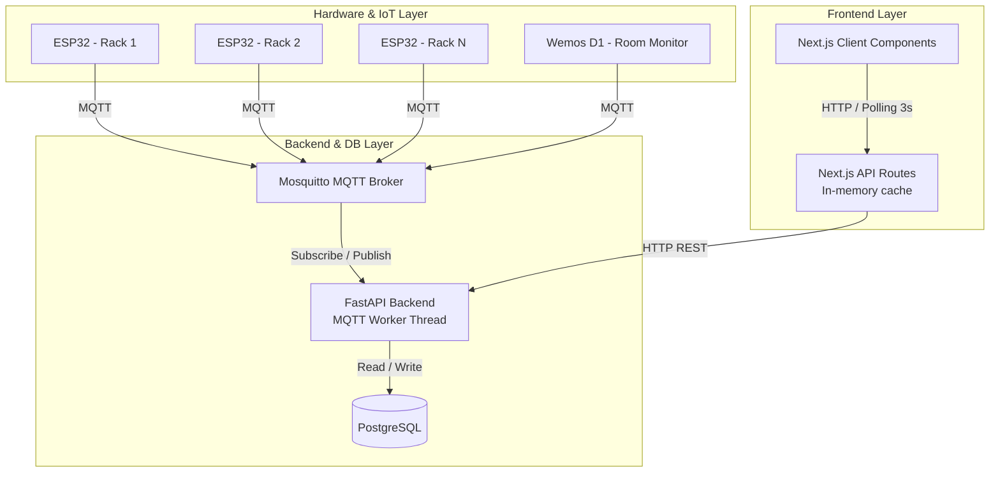
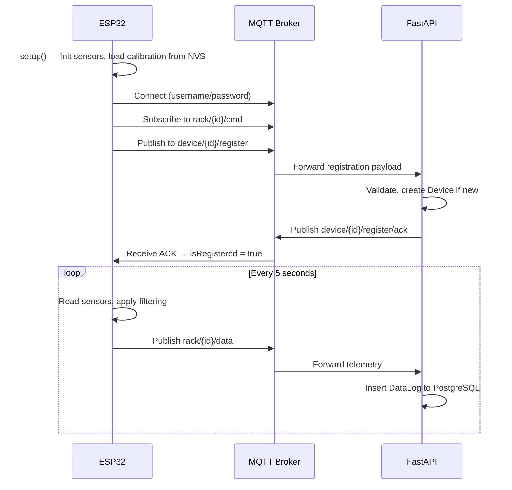

# 🌿 Smart Farming Lab — Full Technical Documentation

## 1. Project Overview

### 1.1 Introduction
The **Smart Farming Lab** is an end-to-end IoT platform designed to monitor and control hydroponic racks in Lab Smart Farming C502, Universitas Multimedia Nusantara. The platform captures real-time telemetry (pH, EC, water temperature, water levels, water flow, and light intensity) from ESP32 controllers, stores the data for analytics, and provides a modern web interface for users to oversee the farm's status, track planting cycles, and perform sensor adjustments.

### 1.2 Key Features

#### 1.2.1 Real-time Telemetry Monitoring
The core dashboard provides a live, auto-refreshing view of the entire hydroponic farm. It polls data from the API every 3 seconds to ensure users always see the latest telemetry for pH, EC, water temperature, water levels, water flow, and light intensity. Each sensor is displayed in a dedicated card with sparkline charts showing recent trends and indicators for threshold deviations.

#### 1.2.2 Historical Data Visualization
To facilitate deeper analysis, the system offers time-series area charts for historical data. Users can filter data by time ranges (1 Hour, 6 Hours, 24 Hours, 7 Days) to observe patterns, detect anomalies, or optimize their farming strategies. Data points are aggregated dynamically on the backend to maintain performance over long time horizons.

#### 1.2.3 Sensor Adjustment Wizard (Calibration)
A guided, step-by-step user interface to accurately adjust and calibrate critical sensors like pH (2-point calibration with buffer solutions) and TDS (1-point calibration). The wizard communicates directly with the ESP32 microcontrollers via MQTT commands, ensuring that adjustments are processed directly at the edge layer and saved to the device's non-volatile memory (NVS).

#### 1.2.4 Hydroponic Planting Tracker
An integrated calendar and tracking module that allows users to record planting dates for each hydroponic rack. The system automatically calculates and displays the current growth stage ("Day X") based on the registered date. This feature leverages the flexible JSONB `attr` field in the PostgreSQL database to persist state seamlessly without requiring additional relational tables.

#### 1.2.5 Threshold Alerts & Notifications
A reactive notification engine (`useNotifications()` hook) that continuously monitors sensor values against predefined bounds (Warning Low/High, Critical Low/High). Notifications are only triggered on **state transitions** (not repeated for the same state), and each alert includes smart remediation messages specific to the sensor and deviation direction. The engine suppresses alerts on first load to prevent notification flooding.

#### 1.2.6 Data Simulation System
A built-in simulation mode powered by React Context API (`SimulationProvider`) that enables demo and testing without physical hardware. Three modes are available: **Stable** (gentle drift around midpoint), **Trending Up** (gradual rise to 85% of max range), and **Trending Down** (gradual descent to 15% of min range). Simulation data bypasses API calls entirely.

### 1.3 Tech Stack
- **IoT & Hardware:** ESP32 NodeMCU-32S (Rack Sensor), Wemos D1 Mini (Room Sensor).
- **Message Broker:** Eclipse Mosquitto (MQTT) with username/password authentication.
- **Backend:** Python 3.14, FastAPI, SQLModel (SQLAlchemy 2.0), Paho-MQTT, Gunicorn.
- **Database:** PostgreSQL 18, Alembic (Migrations).
- **Frontend:** React 19, Next.js 16 (App Router), Tailwind CSS v4, Recharts, Shadcn/UI (Radix UI).
- **Firmware:** PlatformIO, Arduino Framework, ArduinoJson, PubSubClient, BH1750, DallasTemperature, Preferences (NVS).
- **Deployment:** Docker & Docker Compose.

---

## 2. System Architecture

The system follows a three-layer architecture: Device/Edge Layer, Data & Logic Layer, and Presentation Layer.

### 2.1 High-Level Diagram



### 2.2 End-to-End Data Flow
1. **IoT Collection**: ESP32 reads all sensors, applies multi-stage filtering, and builds a JSON payload every 5 seconds.
2. **MQTT Transport**: Data is published to the Mosquitto broker under `rack/{id}/data`.
3. **Backend Ingestion**: FastAPI's background MQTT worker validates the payload via Pydantic, looks up the device by `mac_addr`, and inserts a `DataLog` record into PostgreSQL.
4. **Frontend Proxy**: Next.js Route Handler (`/api/racks`) fetches the latest records from FastAPI, maintains a 25-point in-memory sliding window per sensor for sparkline charts, and maps ESP32 keys (`snake_case`) to frontend keys (`camelCase`).
5. **UI Rendering**: React client components poll `/api/racks` every 3 seconds, updating dashboard cards, calculating trend percentages, and triggering threshold notifications on state transitions.

### 2.3 ESP32 Boot & Registration Flow



---

## 3. Hardware, IoT, and Wiring

This layer handles physical interaction with the hydroponic environment.

### 3.1 Hardware Components

**Rack Sensor Unit (per rack):**
- **Microcontroller**: ESP32 NodeMCU-32S
- **Water Sensors**:
  - Analog pH Sensor (connected to ADC pin)
  - TDS/EC Sensor (connected to ADC pin)
  - DS18B20 Waterproof (Water Temperature, OneWire protocol)
  - HC-SR04 Waterproof Ultrasonic Sensor (Water Level in tank)
  - YF-S201 Water Flow Sensor (pulse-based, interrupt-driven)
- **Environmental Sensors**:
  - BH1750 Digital Light Intensity Sensor (I2C protocol)

**Room Sensor Unit:**
- **Microcontroller**: Wemos D1 Mini (ESP8266-based)
- **Sensor**: DHT22 (Room Temperature & Humidity)

### 3.2 Schematic Diagram
> **[PLACEHOLDER: Insert Schematic Diagram Here]**

### 3.3 PCB Layout
> **[PLACEHOLDER: Insert PCB Layout Here]**

### 3.4 Wiring & Pinout Guide (Rack Sensor)
| Component | ESP32 Pin | Protocol | Function |
| :--- | :--- | :--- | :--- |
| pH Sensor | GPIO 33 (ADC1_CH5) | Analog | ADC reading → 7-stage filtering → pH conversion |
| TDS Sensor | GPIO 35 (ADC1_CH7) | Analog | ADC reading → polynomial formula → TDS ppm |
| DS18B20 | GPIO 4 | OneWire | Digital temperature reading |
| BH1750 | GPIO 21 (SDA) / GPIO 22 (SCL) | I2C | Digital light intensity (lux) |
| Ultrasonic Trigger | GPIO 12 | Digital Output | Send 10µs pulse |
| Ultrasonic Echo | GPIO 14 | Digital Input | Measure echo duration (pulseIn) |
| Flow Sensor | GPIO 27 | Digital Interrupt | Hardware ISR pulse counting (RISING edge) |

**Room Sensor Pinout (Wemos D1):**
| Component | Pin | Protocol | Function |
| :--- | :--- | :--- | :--- |
| DHT22 | GPIO 4 | Digital | Temperature & humidity reading |

### 3.5 Firmware Architecture

The firmware is developed using **PlatformIO** with the **Arduino Framework**. Two separate firmware codebases exist:

- `lib/main-code-rack/` — Full rack sensor firmware (~1100 lines, 36KB)
- `lib/main-code-room/` — Room sensor firmware (~220 lines, 7KB)

**Libraries used:**
| Library | Purpose |
| :--- | :--- |
| PubSubClient | MQTT client for Arduino |
| ArduinoJson | JSON serialization/deserialization |
| BH1750 | I2C light sensor driver |
| DallasTemperature + OneWire | DS18B20 water temperature driver |
| Preferences | ESP32 Non-Volatile Storage (NVS) for calibration persistence |
| DHT | DHT22 sensor driver (room firmware only) |

### 3.6 Sensor Filtering Pipeline (Rack Firmware)

Raw ADC readings from analog sensors (pH, TDS) are noisy. The firmware implements a **7-stage filtering pipeline** in the `readVoltage()` function:

| Stage | Technique | Detail |
| :---: | :--- | :--- |
| 1 | Multi-sampling | Collect 20 ADC samples with 20ms settling delay between reads |
| 2 | Sorting | Bubble sort all 20 samples (ascending) |
| 3 | Outlier trimming | Discard 4 lowest + 4 highest samples (keep 12 middle) |
| 4 | Averaging | Calculate mean of the 12 remaining samples |
| 5 | Voltage conversion | `voltage = avg × (3300.0 / 4095.0)` — 12-bit ADC, 3.3V reference |
| 6 | EMA filter | Exponential Moving Average: `ema = (0.30 × V) + (0.70 × ema_prev)` |
| 7 | Median filter | Maintain 5-sample history buffer, return median value |

**Other sensor reading strategies:**
- **TDS**: 50-sample average → polynomial cubic formula with temperature compensation: `TDS = (133.42V³ - 255.86V² + 857.39V) × 0.5`, where V is compensated by `1.0 + 0.02 × (temp - 25.0)`.
- **Ultrasonic**: 10 readings → discard zeroes → average valid readings. Uses `pulseIn()` with 300ms timeout. Distance = `(echoPulse / 2.0) × 0.0343 cm/µs`.
- **Flow Rate**: Hardware interrupt (ISR marked `IRAM_ATTR`) counts pulses on RISING edge. `flowRate = (pulseCount / 450.0) / elapsed_minutes`.
- **BH1750**: I2C digital read in `CONTINUOUS_HIGH_RES_MODE` (1 lux resolution). Returns -1 on error.

### 3.7 Calibration System (Persistent, Two-Point)

Calibration coefficients are stored in ESP32 **flash memory (NVS)** using the `Preferences` library, ensuring they survive power cycles and reboots.

**Data Structures:**
```cpp
struct PHCalibration {
  float slope;          // Default: 0.07
  float offset;         // Default: -161.0
  bool is_calibrated;
  int num_points;       // 0, 1, or 2
  float point1_voltage, point1_ph;   // pH 4.0 reference
  float point2_voltage, point2_ph;   // pH 7.0 reference
};

struct TDSCalibration {
  float slope;          // Default: 1.0
  float offset;         // Default: 0.0
  bool is_calibrated;
  int num_points;
  float point1_voltage, point1_tds;
  float point2_voltage, point2_tds;  // 1330 ppm reference
};
```

**Calibration Flow (pH):**
1. Frontend sends `KALIBRASI_PH` command via MQTT with `known_value` (e.g., 4.0 or 7.0).
2. ESP32 reads current voltage using the 7-stage pipeline.
3. First point (pH 4.0) → stored as `point1`. Second point (pH 7.0) → stored as `point2`.
4. Two-point linear regression: `slope = (pH1 - pH2) / (V1 - V2)`, `offset = pH1 - (slope × V1)`.
5. Coefficients saved to NVS flash with `saveCalibrationData()`.
6. Conversion formula: `pH = (slope × voltage) + offset`.

**Calibration Flow (TDS):**
- One-point calibration: `offset = known_TDS - base_TDS`.
- Temperature-compensated before calibration.

**NVS Keys Stored (16 parameters total):**
`ph_slope`, `ph_offset`, `ph_cal`, `ph_points`, `ph_p1_v`, `ph_p1_ph`, `ph_p2_v`, `ph_p2_ph`, `tds_slope`, `tds_offset`, `tds_cal`, `tds_points`, `tds_p1_v`, `tds_p1_tds`, `tds_p2_v`, `tds_p2_tds`.

---

## 4. Communication Protocol (MQTT)

### 4.1 MQTT Topics

| Topic | Direction | Publisher | Subscriber | Purpose |
| :--- | :---: | :--- | :--- | :--- |
| `device/+/register` | Upbound | ESP32 | Backend | Initial registration of ESP32 node. |
| `rack/+/data` | Upbound | ESP32 | Backend | Periodic sensor telemetry payload (every 5s). |
| `rack/+/cmd/ack` | Upbound | ESP32 | Backend | Acknowledgment after command execution (SUCCESS/FAILED/TIMEOUT). |
| `rack/{rack_id}/cmd`| Downbound | Backend | ESP32 | Commands sent to ESP32 (e.g., `KALIBRASI_PH`, `KALIBRASI_TDS`, `RESET_CALIBRATION`). |
| `device/+/register/ack` | Downbound| Backend | ESP32 | Registration success confirmation (`{"status": 1}`). |

### 4.2 Payload Examples

**Device Registration (`device/+/register`):**
```json
{
  "mac_addr": "f4c1e01b-46e7-42c5-9f69-05d67a5a6a5b",
  "type_id": "HYDROPONIC_RACKS",
  "desc": "Buat Rack Hydroponic",
  "attr": {
    "about": "ini esp32 untuk rack 1",
    "rack_id": "1"
  }
}
```

**Telemetry Data (`rack/+/data`):**
```json
{
  "mac_addr": "f4c1e01b-46e7-42c5-9f69-05d67a5a6a5b",
  "data": {
    "ph": 6.52,
    "ec": 1245.00,
    "water_temp": 25.3,
    "water_level": 42.5,
    "flow_rate": 2.15,
    "light_intensity": 18500
  }
}
```

**Room Telemetry (`rack/0/data`):**
```json
{
  "mac_addr": "c7b7fae9-34f6-4cc9-8f48-03c295629ed3",
  "data": {
    "temperature": 26.5,
    "humidity": 62.0
  }
}
```

**Calibration Command (`rack/{id}/cmd`):**
```json
{
  "mac_addr": "f4c1e01b-...",
  "command": "KALIBRASI_PH",
  "status": "START",
  "cmd_log": {"known_value": 7.0}
}
```

**Command ACK (`rack/+/cmd/ack`):**
```json
{
  "mac_addr": "f4c1e01b-...",
  "command": "KALIBRASI_PH",
  "status": "SUCCESS",
  "cmd_log": {"known_value": 7.0, "ph": 6.98}
}
```

---

## 5. Backend Infrastructure

**Path:** `hydroponic_be/`  
**Stack:** Python 3.14, FastAPI, SQLModel, Paho-MQTT, Gunicorn.

### 5.1 Directory Structure
- `app/api/routes/` — REST API Routers (`telemetry.py`, `command.py`, `general.py`).
- `app/models/` — Database ORM models (`telemetry.py` → Device, DataLog; `command.py` → CommandLog).
- `app/crud/` — Database queries and transactions (CRUD functions).
- `app/services/` — MQTT background worker (`mqtt_worker.py`) and topic handlers (`mqtt_handler.py`).
- `app/core/` — Configuration and settings (database URL, MQTT credentials).
- `app/db/` — Database engine and session management.
- `app/utils/` — Seeding utility and time helpers.

### 5.2 Application Lifecycle
1. **Startup**: Initializes database connections, runs `seeding_to_db()` to auto-populate reference tables (`CommandType`, `CommandStatus`, `DeviceType`), connects to MQTT broker, and starts the `mqtt_worker` background thread.
2. **Runtime**: FastAPI serves HTTP REST endpoints while the MQTT worker thread asynchronously listens for incoming sensor payloads and command acknowledgments.
3. **Caching**: `get_global_var()` caches reference table lookups (CommandStatus, CommandType, DeviceType) in Python global variables to avoid repeated DB queries on every MQTT message.
4. **Shutdown**: Disconnects from MQTT gracefully via `mqtt_worker.stop()`.

### 5.3 MQTT Worker Architecture

The `MQTTWorker` class wraps `paho-mqtt` as a **thread-safe singleton**:
- `threading.Lock()` for safe handler registration.
- `reconnect_delay_set(min=1s, max=120s)` for exponential backoff on connection loss.
- QoS 1 for command publishing (at-least-once delivery).
- `topic_matches_sub()` for wildcard topic routing.

**MQTT Handlers (`mqtt_handler.py`):**
| Handler | Topic | Action |
| :--- | :--- | :--- |
| `registering_handler` | `device/+/register` | Validate payload → create/find Device → send ACK |
| `telemetry_handler` | `rack/+/data` | Validate payload → lookup device by `mac_addr` → insert `DataLog` |
| `ack_command_handler` | `rack/+/cmd/ack` | Validate payload → resolve command/status IDs → insert `CommandLog` |

### 5.4 REST API Endpoints

| Method | Endpoint | Purpose |
| :--- | :--- | :--- |
| `GET` | `/api/v1/datalogs/latest?device_type=...` | Latest data per device (uses `DISTINCT ON`) |
| `GET` | `/api/v1/datalogs/?limit=&start_date=&end_date=` | All data logs with filters |
| `GET` | `/api/v1/datalogs/{device_id}` | Historical data for one device |
| `GET` | `/api/v1/datalogs/exports/csv` | Stream CSV export (in-memory, no temp files) |
| `POST` | `/api/v1/commandlogs/{rack_id}` | Dispatch command to ESP32 via MQTT |
| `GET` | `/api/v1/commandlogs/latest` | Latest command status per device |
| `GET` | `/api/v1/generals/devices` | List all registered devices |
| `PATCH` | `/api/v1/generals/devices/{id}/planted-date` | Update `planted_at` in JSONB `attr` |
| `GET` | `/health` | Docker healthcheck endpoint |

### 5.5 Connection Pooling
The SQLAlchemy engine is configured with `pool_size=10` and `max_overflow=20`, supporting up to 30 concurrent database connections. `echo=False` disables SQL logging for production performance.

---

## 6. Database Architecture

**Stack:** PostgreSQL 18, SQLModel (ORM), Alembic (Migrations).

### 6.1 Entity-Relationship Diagram (ERD)

```mermaid
erDiagram
    DeviceType ||--o{ Device : "has"
    DeviceType {
        int id PK
        string desc
        jsonb attr
    }

    Device ||--o{ DataLog : "generates"
    Device ||--o{ CommandLog : "receives"
    Device {
        int id PK
        string mac_addr
        string desc
        jsonb attr
        int devicetype_id FK
    }

    DataLog {
        int device_id PK_FK
        datetime timestamp PK
        jsonb data_log
    }

    CommandType ||--o{ CommandLog : "defines"
    CommandType {
        int id PK
        string desc
        jsonb attr
    }

    CommandStatus ||--o{ CommandLog : "tracks"
    CommandStatus {
        int id PK
        string desc
        jsonb attr
    }

    CommandLog {
        int command_id PK_FK
        int status_id PK_FK
        int device_id PK_FK
        datetime timestamp PK
        string created_by
        jsonb cmd_log
    }
```

### 6.2 Seeded Reference Data

**DeviceType:** `HYDROPONIC_RACKS`, `ROOM_MONITORING`

**CommandType:** `PUMP_ON`, `PUMP_OFF`, `KALIBRASI_TDS`, `KALIBRASI_PH`, `RESET_CALIBRATION`

**CommandStatus:** `START`, `PENDING`, `SUCCESS`, `FAILED`, `TIME_OUT`, `BROKER_DOWN`

### 6.3 Device Attributes (`attr` JSONB)
The `attr` column in the `Device` table stores dynamic attributes without schema migration:
- `rack_id` (string) — Maps physical rack number (1-5) to database device ID. Queried via `cast(Device.attr["rack_id"].as_string(), Integer)`.
- `planted_at` (string, ISO date) — Planting date for the **Hydroponic Planting Tracker**. Allows the frontend to calculate "Day X" without a separate table.
- `about` (string) — Human-readable device description.

### 6.4 Timezone Strategy
All `timestamp` columns use `DateTime(timezone=True)` and default to UTC via `get_utc_now()`. Conversion to `Asia/Jakarta` (WIB) happens at the query level using `func.timezone('Asia/Jakarta', timestamp)`, ensuring consistent storage and flexible display.

---

## 7. Frontend Architecture

**Path:** `hydroponic_fe/`  
**Stack:** Next.js 16 (App Router), React 19, TailwindCSS v4, Shadcn/UI, Recharts.

### 7.1 Pages & Routes

| Route | Component | Description |
| :--- | :--- | :--- |
| `/` | `page.tsx` | Main dashboard — room monitor, rack cards, navbar |
| `/history` | `history/page.tsx` | History hub — navigation to per-rack charts |
| `/rack/[id]` | `rack/[id]/page.tsx` | Time-series area charts (Recharts) with time range filters |
| `/planted-date` | `planted-date/page.tsx` | Planting management — set/reset planting dates |
| `/calibration` | `calibration/page.tsx` | Sensor adjustment overview |
| `/calibration/[rackId]` | `calibration/[rackId]/page.tsx` | Step-by-step calibration wizard (pH & TDS) |
| `/docs` | `docs/page.tsx` | This technical documentation page |

### 7.2 Key Components

| Component | File | Purpose |
| :--- | :--- | :--- |
| `RackCard` | `components/rack-card.tsx` | Sensor dashboard card per rack (6 sensors, sparklines, trend %) |
| `RackCardHorizontal` | `components/rack-card-horizontal.tsx` | TV/widescreen horizontal layout variant |
| `RoomMonitor` | `components/room-monitor.tsx` | Room temperature & humidity widget (DHT22 data) |
| `TopNavbar` | `components/top-navbar.tsx` | System status, navigation, simulation controls, mobile drawer |
| `NotificationCenter` | `components/notification-center.tsx` | Bell icon + dropdown with notification list |
| `CalibrationWizard` | `components/calibration/` | 4-component wizard (pH steps, TDS steps, live sensor display) |

### 7.3 Data Flow & In-Memory Cache

```
Browser (React) ─── polls every 3s ───> Next.js Route Handler (/api/racks)
                                              │
                                              ├── fetches /api/v1/datalogs/latest from FastAPI
                                              ├── fetches /api/v1/generals/devices for planted_at
                                              ├── maintains Map<rackId, RackStore> in-memory
                                              │   └── each RackStore keeps 25-point history per sensor
                                              ├── maps keys: ph→ph, ec→ec, water_temp→waterTemp, etc.
                                              └── returns JSON array of 5 racks + isOnline flag
```

**Key mapping (ESP32 → Frontend):**
| ESP32 Key | Frontend Key |
| :--- | :--- |
| `ph` | `ph` |
| `ec` | `ec` |
| `water_temp` | `waterTemp` |
| `water_level` | `waterLevel` |
| `flow_rate` | `waterFlow` |
| `light_intensity` | `lightIntensity` |

### 7.4 Sensor Thresholds Engine

Defined in `src/lib/thresholds.ts`. Each sensor has configurable bounds:

| Sensor | Unit | Warning Low | Warning High | Critical Low | Critical High |
| :--- | :--- | :---: | :---: | :---: | :---: |
| pH | pH | 5.5 | 6.5 | 4.5 | 7.5 |
| EC | mS/cm | 0.8 | 2.5 | 0.3 | 3.5 |
| Water Temp | °C | 18 | 28 | 15 | 32 |
| Water Level | % | 30 | 90 | 15 | 100 |
| Water Flow | L/min | 1.0 | 5.0 | 0.3 | 8.0 |
| Light Intensity | lux | 5000 | 40000 | 1000 | 60000 |

**Status evaluation order:** Critical → Warning → Normal. Visual colors: `#34473d` (Normal), `#f8650c` (Warning), `#8c0000` (Critical).

### 7.5 Notification Engine

The `useNotifications()` hook in `src/lib/notifications.ts`:
1. **First render**: Captures initial sensor statuses without generating notifications (prevents flood on page load).
2. **Subsequent updates**: Compares new status vs. previous per sensor per rack. Only generates notifications on **transitions into warning/critical**.
3. **Smart remediation**: `getRemediationSmart()` determines deviation direction (low/high) based on midpoint of warning range, then returns specific action messages (e.g., "Tambahkan larutan pH Up secara bertahap").
4. **Capacity limit**: Maximum 50 notifications stored.

### 7.6 Simulation System

The `SimulationProvider` in `src/lib/simulation-context.tsx` wraps the entire application:
- **Stable mode**: `drift()` function applies small random noise + weak pull (`pullStrength: 0.01`) toward range midpoint.
- **Trending Up**: Strong pull (`0.03`) toward 85% of max range → sensors gradually enter warning/critical zones.
- **Trending Down**: Strong pull toward 15% of min range.
- Data ticks every 2.5 seconds. `clamp()` ensures values stay within physical bounds.
- When simulation is active, `useRacks()` and `useRoomSensor()` hooks return simulated data instead of fetching from API.

### 7.7 UI Design System

- **Theme**: Glassmorphism — `bg-white/40 backdrop-blur-md border border-white/20`
- **Color Palette**: Primary dark green `#34473d`, gradient `#50705f → #86a293`, page background `#ece9e5`
- **Typography**: Geist, Geist Mono, Manrope, Hanken Grotesk, JetBrains Mono (Google Fonts via CSS variables)
- **Background**: Two AVIF images (garden top, green field bottom) with CSS mask gradient
- **Responsive**: Grid mode (mobile/desktop), List/TV mode (widescreen lab display), mobile Drawer navigation

---

## 8. Deployment & Environment

The project is fully dockerized.

### 8.1 Docker Compose Services
| Service | Image | Ports | Healthcheck | Description |
| :--- | :--- | :--- | :--- | :--- |
| `db` | `postgres:18.3-alpine` | `5432` | `pg_isready` every 5s | Primary Database (pgdata volume) |
| `broker` | Custom Mosquitto | `1883` | `mosquitto_pub` every 10s | MQTT Broker with auth |
| `backend` | Custom FastAPI | `8000` | Depends on db + broker `service_healthy` | FastAPI + MQTT Worker |
| `frontend` | Custom Next.js | `3000` | Depends on backend | Next.js App |

### 8.2 Dependency Chain
```
db (healthy) ──┐
               ├──> backend ──> frontend
broker (healthy)┘
```
Backend will not start until both `db` and `broker` pass their healthchecks (`condition: service_healthy`).

### 8.3 Execution Commands

**Development Mode (Local):**
```bash
# Start Broker & DB
docker compose -f compose.prod.yml up broker db -d

# Start Backend
cd hydroponic_be
uv sync
source .venv/bin/activate
alembic upgrade head
uvicorn app.main:app --reload

# Start Frontend
cd hydroponic_fe
npm install
npm run dev
```

**Production Mode:**
```bash
./start.prod.sh
```

---

## 9. Code Conventions & Best Practices

- **Timezone Management**: All database timestamps are UTC. They are converted to `Asia/Jakarta` at the API query level using `func.timezone()`.
- **Identifiers**: `rack_id` (Physical, 1-5) vs `device_id` (Database PK). The frontend universally uses `rack_id` for routing and component mapping.
- **Edge Computing Strategy**: Sensor calibration math (slope/offset calculation, NVS storage) happens on the ESP32 to reduce latency. The backend relays commands and logs results.
- **JSONB for Extensibility**: Dynamic attributes (`rack_id`, `planted_at`) stored in JSONB `attr` columns, avoiding schema migrations for new features.
- **Sensor Key Mapping**: ESP32 uses `snake_case` keys; frontend uses `camelCase`. The Next.js proxy layer performs the mapping via `SENSOR_MAP` constant.
- **Hydration Safety**: Time-sensitive UI elements use dedicated `ClientTime` component that renders only on client side to prevent SSR hydration mismatches.
