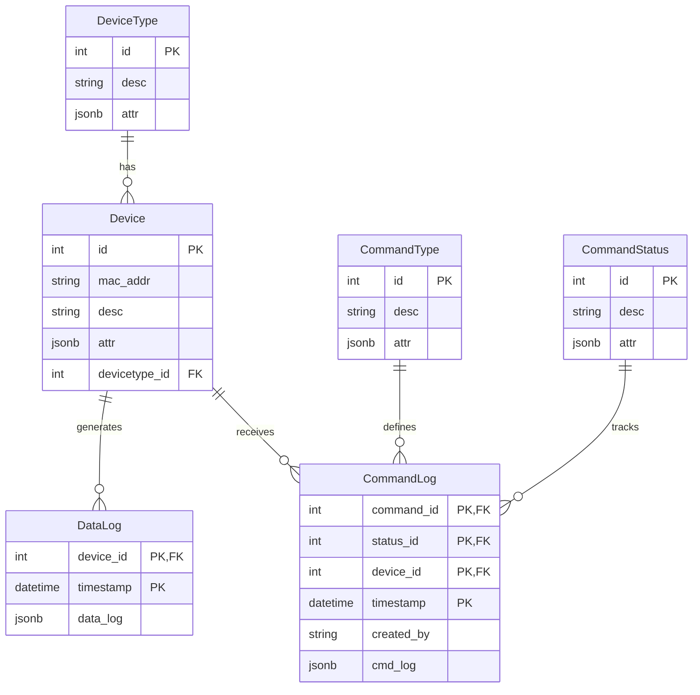

# 🌿 Smart Farming Lab — Full Technical Documentation

## 1. Project Overview

### 1.1 Introduction
The **Smart Farming Lab** is an end-to-end IoT platform designed to monitor and control hydroponic racks. The platform captures real-time telemetry (pH, EC, water temperature, water levels, water flow, and light intensity) from ESP32 controllers, stores the data for analytics, and provides a modern web interface for users to oversee the farm's status, track planting cycles, and perform sensor adjustments.

### 1.2 Key Features

#### 1.2.1 Real-time Telemetry Monitoring
The core dashboard provides a live, auto-refreshing view of the entire hydroponic farm. It polls data from the API every 3 seconds to ensure users always see the latest telemetry for pH, EC, water temperature, water levels, water flow, and light intensity. Each sensor is displayed in a dedicated card with sparkline charts showing recent trends and indicators for threshold deviations.
> **[PLACEHOLDER: Insert Real-time Dashboard Image Here]**
> 

#### 1.2.2 Historical Data Visualization
To facilitate deeper analysis, the system offers time-series area charts for historical data. Users can filter data by time ranges (1 Hour, 6 Hours, 24 Hours, 7 Days) to observe patterns, detect anomalies, or optimize their farming strategies. Data points are aggregated dynamically on the backend to maintain performance over long time horizons.
> **[PLACEHOLDER: Insert Data Visualization Charts Image Here]**
> 

#### 1.2.3 Sensor Adjustment Wizard (Calibration)
A guided, step-by-step user interface to accurately adjust and calibrate critical sensors like pH (2-point calibration with buffer solutions) and TDS (1-point calibration). The wizard communicates directly with the ESP32 microcontrollers via MQTT commands, ensuring that adjustments are processed directly at the edge layer and saved to the device's non-volatile memory.
> **[PLACEHOLDER: Insert Sensor Adjustment Wizard Image Here]**
> 

#### 1.2.4 Hydroponic Planting Tracker
An integrated calendar and tracking module that allows users to record planting dates for each hydroponic rack. The system automatically calculates and displays the current growth stage ("Day X") based on the registered date. This feature leverages the flexible JSONB `attr` field in the PostgreSQL database to persist state seamlessly without requiring additional relational tables.
> **[PLACEHOLDER: Insert Planting Tracker Image Here]**
> 

#### 1.2.5 Threshold Alerts & Notifications
A robust notification engine that continuously monitors sensor values against predefined, configurable bounds (Warning Low/High, Critical Low/High). If a sensor breaches a threshold, the system immediately dispatches real-time alerts to the user interface, ensuring prompt intervention to prevent crop damage.
> **[PLACEHOLDER: Insert Threshold Alerts Image Here]**
> 


### 1.3 Tech Stack
- **IoT & Hardware:** ESP32 Microcontrollers, Environmental & Water Sensors.
- **Message Broker:** Eclipse Mosquitto (MQTT).
- **Backend:** Python 3.14, FastAPI, SQLModel (SQLAlchemy 2.0), asyncpg, Paho-MQTT.
- **Database:** PostgreSQL 18.
- **Frontend:** React 19, Next.js 16 (App Router), Tailwind CSS v4, Recharts, Shadcn/UI.
- **Deployment:** Docker & Docker Compose.

---

## 2. System Architecture

The system follows a three-layer architecture: Device/Edge Layer, Data & Logic Layer, and Presentation Layer.

### 2.1 High-Level Diagram


### 2.2 End-to-End Data Flow
1. **IoT Collection**: ESP32 collects sensor data every few seconds.
2. **MQTT Transport**: Data is published to the Mosquitto broker under `rack/{id}/data`.
3. **Backend Ingestion**: FastAPI's background MQTT worker receives the payload and maps it to a database record in PostgreSQL (`DataLog`).
4. **Frontend Proxy**: Next.js API periodically fetches the latest records from FastAPI, keeping an in-memory sliding window for short-term history.
5. **UI Rendering**: The React frontend polls Next.js API, updating the dashboard, charts, and triggering notifications if thresholds are breached.

---

## 3. Hardware, IoT, and Wiring

This layer handles physical interaction with the hydroponic environment.

### 3.1 Hardware Components
- **Microcontroller**: ESP32 Development Board.
- **Water Sensors**:
  - Analog pH Sensor
  - TDS/EC Sensor
  - DS18B20 (Water Temperature)
  - Ultrasonic / Float Switch (Water Level)
  - Water Flow Sensor
- **Environmental Sensors**:
  - DHT22 (Room Temperature & Humidity)
  - LDR / BH1750 (Light Intensity)
- **Actuators**: Relay modules for water pumps.

### 3.2 Schematic Diagram
> **[PLACEHOLDER: Insert Schematic Diagram Here]**
> *(Image of the ESP32 and sensor connections schematic)*
> 

### 3.3 PCB Layout
> **[PLACEHOLDER: Insert PCB Layout Here]**
> *(Image of the customized PCB board design)*
> 

### 3.4 Wiring & Pinout Guide
| Component | ESP32 Pin | Function |
| :--- | :--- | :--- |
| pH Sensor | GPIO 34 (ADC) | Analog reading for pH |
| TDS Sensor | GPIO 35 (ADC) | Analog reading for EC |
| DS18B20 | GPIO 4 | One-Wire temp reading |
| Flow Sensor| GPIO 2 | Interrupt pulse counting |
| Relay (Pump)| GPIO 14 | Digital Output (Active High/Low) |
*(Note: Adjust the pinout table based on actual final wiring configuration)*

### 3.5 Firmware Logic (ESP32)
- **Data Gathering**: Reads ADC values, applies mathematical formulas to convert raw data to actual units (e.g., pH value, TDS ppm).
- **Sensor Adjustment Calculation**: The ESP32 handles the math for sensor adjustment. For pH, it receives known buffer values (7.0 & 4.0), calculates slope and offset, and saves to non-volatile flash memory.
- **MQTT Communication**: Connects to Mosquitto, subscribes to command topics (`rack/+/cmd`), and publishes telemetry to data topics.

---

## 4. Communication Protocol (MQTT)

### 4.1 MQTT Topics

| Topic | Direction | Publisher | Subscriber | Purpose |
| :--- | :---: | :--- | :--- | :--- |
| `device/+/register` | Upbound | ESP32 | Backend | Initial registration of ESP32 node. |
| `rack/+/data` | Upbound | ESP32 | Backend | Periodic sensor telemetry payload. |
| `rack/+/cmd/ack` | Upbound | ESP32 | Backend | Acknowledgment returned by ESP32 after command execution. |
| `rack/{rack_id}/cmd`| Downbound | Backend | ESP32 | Commands sent to ESP32 (e.g., Sensor Adjustment). |
| `device/+/register/ack` | Downbound| Backend | ESP32 | Registration success confirmation. |

### 4.2 Payload Examples

**Telemetry Data (`rack/+/data`):**
```json
{
  "mac_addr": "AA:BB:CC:DD:EE:FF",
  "data": {
    "ph": 6.2,
    "ec": 1.8,
    "water_temp": 24.5,
    "water_level": 75,
    "water_flow": 3.2,
    "light_intensity": 22000
  }
}
```

**Command ACK (`rack/+/cmd/ack`):**
```json
{
  "mac_addr": "AA:BB:CC:DD:EE:FF",
  "command": "KALIBRASI_PH",
  "status": "SUCCESS",
  "cmd_log": {"ph_slope": 1.02, "ph_offset": -0.1}
}
```

---

## 5. Backend Infrastructure

**Path:** `hydroponic_be/`  
**Stack:** Python 3.14, FastAPI, SQLModel, Paho-MQTT.

### 5.1 Directory Structure
- `app/api/`: REST API Routers (`telemetry.py`, `command.py`, `general.py`).
- `app/models/`: Database ORM models.
- `app/crud/`: Database queries and transactions.
- `app/services/`: MQTT background worker and topic handlers.
- `app/core/`: Configuration and settings.

### 5.2 Application Lifecycle
1. **Startup**: Initializes database connections, runs `seeding_to_db()`, connects to MQTT broker, and starts the `mqtt_worker` thread.
2. **Runtime**: FastAPI serves HTTP REST endpoints while the MQTT thread asynchronously listens for incoming sensor payloads.
3. **Shutdown**: Disconnects from MQTT gracefully.

### 5.3 REST API Endpoints
- `GET /api/v1/datalogs/latest`: Used by frontend for real-time dashboard.
- `GET /api/v1/datalogs/{device_id}`: Used for historical area charts.
- `POST /api/v1/commandlogs/{rack_id}`: Dispatches commands (like `PUMP_ON`, `KALIBRASI_PH`) to the ESP32 via MQTT.
- *Planting Tracker*: Device attributes can be updated via API to store planting dates (`planting_date`) inside the JSONB `attr` field.

---

## 6. Database Architecture

**Stack:** PostgreSQL 18, SQLModel (ORM), Alembic (Migrations).

### 6.1 Entity-Relationship Diagram (ERD)



### 6.2 Device Attributes (`attr` JSONB)
The `attr` column in the `Device` table is heavily used:
- Stores `rack_id` (1-5) to map physical hardware to database devices.
- Stores `planting_date` for the **Hydroponic Planting Tracker**. This allows the frontend to calculate "Day X" since planting without needing a separate relational table.

---

## 7. Frontend Architecture

**Path:** `hydroponic_fe/`  
**Stack:** Next.js 16 (App Router), React 19, TailwindCSS v4.

### 7.1 Core Modules & Features
- **Dashboard (`/`)**: Shows overall farm health, room monitor widget, and individual `RackCard` components. Real-time data is polled every 3s.
- **Planting Tracker**: Integrated into the UI to show crop growth days. Contains a "Harvest/Reset" button that updates the database JSONB field.
- **History Hub (`/history` & `/rack/[id]`)**: Time-series charts built with Recharts, with time range filters (1H, 6H, 24H, 7D).
- **Sensor Adjustment Wizard (`/calibration/[rackId]`)**: A step-by-step UI to adjust pH (2-point) and TDS (1-point). Commands are sent to backend and UI polls for acknowledgment. *(Note: All UI references use "Adjustment" instead of "Calibration" per project standards).*

### 7.2 Data Flow & Virtualization
To avoid overwhelming the database with high-frequency dashboard queries:
1. Client polls Next.js Route Handler (`/api/racks`).
2. Next.js fetches `/api/v1/datalogs/latest` from the backend.
3. Next.js maintains a rolling in-memory array (`HISTORY_LENGTH=25`) for sparkline charts.

### 7.3 Sensor Thresholds Engine
Defined in `src/lib/thresholds.ts`, it dictates the visual status (`Normal`, `Warning`, `Critical`) for every sensor type based on configured limits (e.g., pH warning at < 5.5 or > 6.5). Notifications are automatically triggered when state changes.

---

## 8. Deployment & Environment

The project is fully dockerized.

### 8.1 Docker Compose Services
| Service | Image | Ports | Description |
| :--- | :--- | :--- | :--- |
| `db` | `postgres:18.3-alpine` | `5432` | Primary Database |
| `broker` | `broker:0.1` (Mosquitto) | `1883` | MQTT Broker |
| `backend` | `backend:0.1` | `8000` | FastAPI (Waits for DB & Broker) |
| `frontend` | `frontend:0.1` | `3000` | Next.js Frontend |

### 8.2 Execution Commands

**Development Mode (Local):**
```bash
# Start Broker & DB
docker compose -f compose.prod.yml up broker db -d

# Start Backend
cd hydroponic_be
uv sync
source .venv/bin/activate
alembic upgrade head
uvicorn app.main:app --reload

# Start Frontend
cd hydroponic_fe
npm install
npm run dev
```

**Production Mode:**
```bash
./start.prod.sh
```

---

## 9. Code Conventions & Best Practices

- **Timezone Management**: All database timestamps are UTC. They are converted to `Asia/Jakarta` at the API edge.
- **Identifiers**: `rack_id` (Physical, 1-5) vs `device_id` (Database PK). The frontend universally uses `rack_id` for routing and component mapping.
- **Edge Computing Strategy**: Complex computations for sensor adjustments happen on the ESP32 to reduce latency and maintain sensor independence. The backend simply relays commands and logs the results.
